# What is the Neo6502 ?
This is the Neo6502 main board. The main components are a 65C02 and a Raspberry Pi Pico. The 65C02 runs the machine code (at about 6.3Mhz) ; the Pico does pretty much everything else.

Most of this document describes its use for a seperate new Retrocomputer design. There are other projects which use the board to emulate real machines ; currently the Apple 2, Oric and Commodore 64 are in development. At the time of writing I do not believe the C64 emulator is publicly released.

There are other models ; early adopters had an A board (this is version B) which is almost identical, but Purple rather than Red, and requires a couple of wires to work properly.

There is also a 'portable' machine which exists in prototype form (at the time of writing) which has an LCD Screen, 4 UEXT sockets and a built in hub.

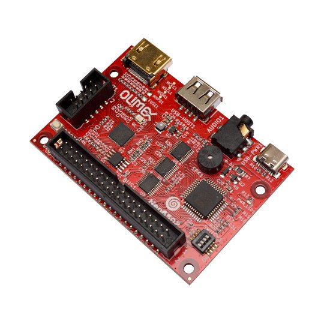

# Read this before Purchasing

## What do you need

Besides the board itself, you will need various other devices to make the computer work. Most of these are relatively straightforward.

Some however are <u>worth acquiring when you buy the board</u>. This is because some distributors, most in fact, charge a significant amount for postage for small orders, so if you order them later it will be more expensive.

### USB Hub issues.

The Raspberry Pi PICO has a technical problem when used in conjunction with the tinyUSB library. Not all USB hubs work with it. If you want to use the Apple, Oric, or C64 emulators you may not need a USB hub, but "Morpheus" does. Following some investigation, it was discovered that only certain chipsets worked, so Olimex produced a small USB hub using that chipset. 

Buying this is well worth considering as it is not expensive (currently 8 Euros). If you have a USB hub, it may be worth trying. The Raspberry Pi hubs built into the keyboard appear to work correctly. But this cannot be guaranteed as the chips used may change.

This has been reported as a fault, investigated, and it seems at present it is not fixable. It is possible this hub may be integrated onto later versions of the board.

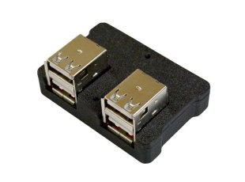

### Optional Gamepad 

Gamepads are easier to acquire. This Gamepad, a copy of a Super Nintendo controller with a USB connector can be acquired from several sources. One of the issues with USB Game controllers is that there seems to be no standard (if you look at the Linux source there is a list of driver options for all sorts of keyboards). Currently we only support certain types of keyboards. Again, this is obtainable from Olimex and it will be the 'correct model'. The author has similar looking gamepads not acquired from Olimex, and they seem to work (it depends on the USB ID) but they may not. There is support for some other gamepads included.

It's <u>not</u> a requirement. The "Operating System" of Morpheus uses keyboard keys if no gamepad is present.

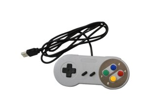

### A-A cable or Programmer

To program the Pico , you either need a USB A - USB A cable is required, it is also possible to use a Programmer and the 'openocd' software as developers for the Pico do. The Neo6502 usually comes programmed with an Apple 2 emulator and Morpheus is still updated for bug fixes and occasional enhancements. It is not required for to day to day use of the machine.

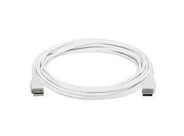

### Case

This is completely optional ; it is a small box which the Neo6502 board fits into, all the main sockets and connectors are exposed. For P&P reasons , if you want it, it probably makes sense to order it at the same time as the board. It is available in blue or red lettering.

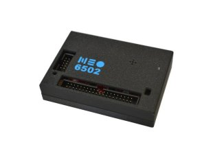

## Common Devices

### Keyboard

A standard USB keyboard is used, these seem to work almost 100%.

### HDMI display

The output is DVI through a HDMI connector. There is currently a discussion about whether it should be powered or not, currently it is not. It does not seem to work well with adaptors and some displays, notably LG.

### USB Key

If you want to save programs then a USB key is required (It is possible to use SD Cards). For similar reasons to the USB Hub we believe, it requires a fast key. Initially I used "Amazon Cheapies" and none of them worked properly. I replaced this with a Sandisk USB key which was about £10 and it works fine.

### Power Cable

Power is supplied through a USB C type cable of the type that are commonly available.

### Sound Device

Sound is provided on board by a simple buzzer. This is perfectly okay for beeps and squawks, and fairly audible. It is possible to plug a sound device in which has a 3.5mm Jack plug.

### SD Card (as an option)

The system does still support the use of SD Cards. This requires the Olimex UEXT SD Card adaptor.

# Getting the board running
This section helps you get the board up and running with the Morpheus software. If you want to use the Apple, Oric or C64 emulators, the process is similar, but you use a different UF2 file.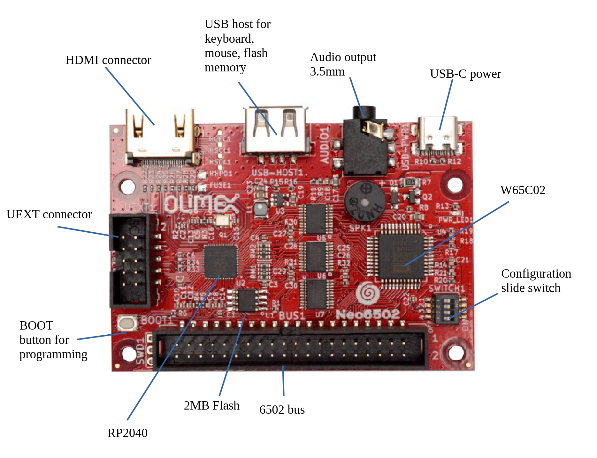
## Setting the DIP switches

There is a small configuration slide switch next to the long connector on one side of the board, marked "SWITCH1". Olimex supplies these as "all on" (as per the diagram above).

Switch 1 enables and disables the buzzer. Switches 2-4 connect UEXT lines to NMI, IRQ and Reset and it is strongly recommended that these are set to off.

## USB Key

The USB key should be formatted to FAT32

## Wiring it up

1. Plug the HDMI Monitor into the HDMI connector using a standard HDMI cable.
2. Plug the USB hub, if you are using one, or the keyboard, into the USB host socket and plug the Gamepad, USB Key and Keyboard into the USB host
3. Plug the power cable into the USB C socket, and connect the other end to power.

This *should* boot up the Apple 2 emulator, which should appear in the form of a menu of games, which you can select and run using the keyboard.

If not, try removing the USB host and just plugging the keyboard into the middle socket.

If this doesn't work, try reprogramming it with Morpheus (see below) and see what happens there.

#### Note for SD Card users

If you are using the SD card it should come with a short ribbon cable which plugs into the SDCard board and the UEXT socket on the Neo6502 board.

## Reprogramming with Morpheus

First you need to download the current release of the Morpheus software from https://github.com/paulscottrobson/neo6502-firmware . The releases are on the right of the screen, the current release is 0.28.1. Clicking on it should show the releases page which has a link to "neo6502.zip"

Download and extract this file. You will see something like this, this is Linux, but it will be very similar on Windows or Macintosh.

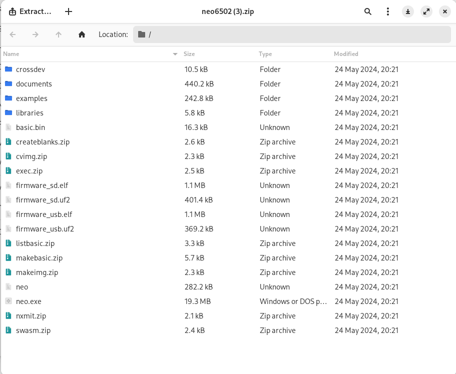

Initially you need one of the two files in the middle "firmware_usb.uf2" or "firmware_sd.uf2". Most people will need the first one, the second one is if you use the SD Card for storage.

You can also copy the examples/basic files to your storage device (normally the USB key). It is recommended you create one file just for testing.

1. Remove the keyboard or USB hub from the middle socket, and connect the Neo6502 board to your PC using the A-A cable - this should fit into any standard PC socket.
2. Turn the power to the board off.
3. You now need to put the board into "Upload" mode. This is a similar upload to any other Pi Pico device. Hold the boot button down (see the picture above) and turn the power back on, then release the boot button. If you have already put the board in the case there is a hole to access the boot button which needs something thin and pointy (I use an old multimeter probe)

The board should now appear in the file system of your host computer. For example, on Linux/Gnome it is like this. Exactly what you see will depend on your operating system and desktop, but you should see "RPI-RP2" mounted as a drive.

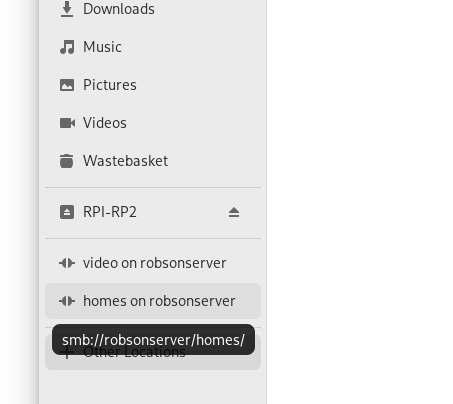

You now need to copy the uf2 file above to this drive. This again depends on the system you are using.

Hopefully the system should now boot. The machine should make it's boot sound (a low beep and a high beep - it sounds like a BBC Micro) https://www.youtube.com/watch?v=Nd9MzxIbuQI and it should display the Neo6502 logo, title, and Olimex title.

**Finally** unplug the A cable and plug the USB hub or keyboard back in. More than once I have forgotten to do this and wondered why the keyboard is not working.

## What does the boot mean

Below the logos, you should see.

### Morpheus Version

The Morpheus title and version in Yellow - it currently says "Morpheus Firmware: v 0.28.1"

### Storage Type

It should say "USB Storage" or "SD Card Storage" depending on your choice of firmware

### USB Devices

Your USB devices should now be listed. Mine says:

- No driver found for 04D9:0006 (this is the Pi Pico USB hub I think)
- USB Key found 0781:55a3
- Gamepad driver found 081f E401

Not all devices are detected, this does not matter.

## Check it works and doing a Catalogue
Below the USB list it should say "Welcome to NeoBasic" in green. You are now running a classic BASIC interpreter - so for example

`print 22/7` [ENTER]

causes 3.142857 to be printed. If  you type 

`cat`

it should list all the files in the root directory of the USB key

## Running a simple BASIC program
To get you started, and show you some of our neater features, we will write a very simple BASIC program, which many of you will have seen many times.

```
10 for i = 1 to 10

20 print "Hello, world !"

30 next
```

and type run to run it, like this.

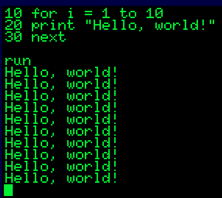

### Using the editor
Many people don't like line number programming. Even with an on screen editor - you can move the arrow keys up and make the 10 at the end of line 10 to 20, press [ENTER] and run it again.

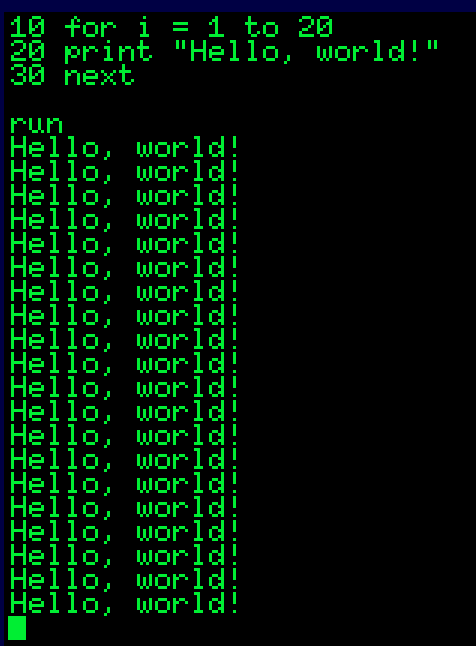

But the developers decided it would be better to have a proper editor. (It is possible to cross-develop in BASIC using the emulator or the serial port)

So type `edit` and press ENTER

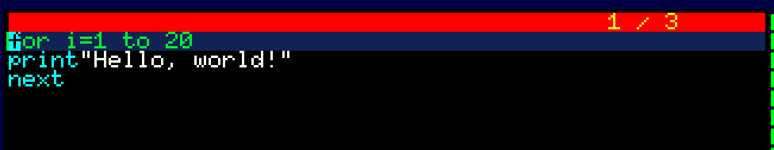

And you can edit like on a word processor (Ctrl+P and Ctrl+Q insert/delete lines). Not a very good word processor, but it's better than line numbers. 

When you have finished press ESC to leave the editor and you can run it again. You can speed this up using the function keys e,g, from the BASIC command line (e.g. where you type stuff in)

`fkey 1,"edit"+chr$(13)`

This sets function key F1 on the keyboard to type edit and press ENTER (character code 13).

### Saving Loading and Catting

You can save your program with

`save "hello.bas"`

It is a convention that .bas is used for BASIC files, but it's not mandatory. You can reload it with`load "hello.bas"` and run it with `run "hello.bas"`

`cat` should show it stored in the directory ; if you have lots of files already you can `cat "hell"` which will show all files with hell in it.

# Where Next
So you now have a working Neo6502. Here are some places to explore.

## Wiki

There is a wiki which various other features at https://github.com/paulscottrobson/neo6502-firmware/wiki ; this is pretty basic but is currently under review for expansion.
## Discord
There is an active discord where you can ask questions or whatever of the people involved in software and hardware, and ask for assistance. 

There is a link to join it here https://www.facebook.com/groups/745798620676673/permalink/852689913320876

## Languages available

C and Pascal development are currently working well (both LLVM and CC65) as well as Assembler and BASIC. Forth and a variant are currently under development. There is an early version of LLVM documentation and a more complete Pascal example on the wiki page.

## Other software

Other software is available, linked from the Wiki, now including a Tile map and Sprite editor, and a file manager, and some games.

## Facebook
There is a facebook group here https://www.facebook.com/groups/745798620676673
## BASIC & API Documents (at present)
The release contains two documents basic.pdf and api.pdf which detail the BASIC interpreter and the API operation respectively. They are rather dry but complete.
## Assembler, BASIC , C and Pascal examples
Under examples are a variety of sample programs some of which are full programs, some demonstrate specific features of BASIC or the API. The .bsc files are text versions of the BASIC files.
## The Youtube series
There is a 7 part youtube video series of about 30 minutes in total here https://www.youtube.com/watch?v=FbcAHRVTqpE which walks through programming a simple game in BASIC using cross development and external tools. Much of it is applicable to C and Pascal which uses the same API - many BASIC commands are simple wrappers round the API functions.